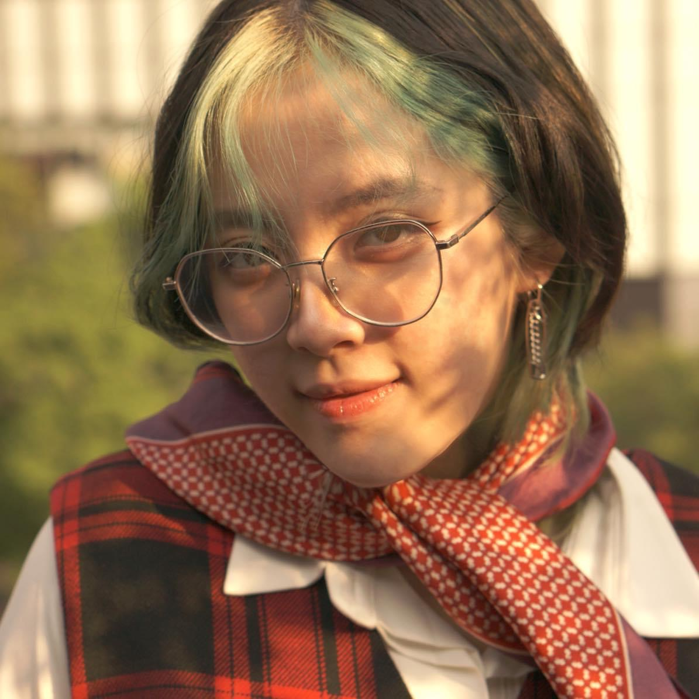

# Homework 1 Assignment
This is our coop repo for Homework1 -  Multi Authoring class. 
---
# Team GECKO - Hello Everyone, this is Alex, Andrea and Zakia
## Anh Phuong Nguyen (Alex)
### This is my picture
 
### My 3 hobbies
1. Read manga, comics, books
2. Play games (FPS, gacha, slasher)
3. Watch Youtube commentaries
### My 3 Designer life goal
* Make excellent web design that serves the purposes of functionality, smooth transitions and good user experience.
* Get more into coding, specifically leaning more to front end dev.
* Work in a good agency where I can fulfill my duties and cooperate with many more wonderful talents.
### My life in 10 emojis
👸🥰👾🐍🦎💃🤦‍♀️🤟🤤🥺
---

<!-- This is the last part, do not write anything below this line-->
## Installation
There is no installation process, you can just use it right away.
## Usage
This is for Homework1 - Multi Author class, proceed with caution.
## Contributing
1. Make sure you want to you this template, then fork it.
2. Clone this repo and make some branches.
3. Make your adjustment and any necessary fill in.
4. Push to the main branch
5. Submit a pull request and wait for a merge ;)
## Credits
- Anh Phuong Nguyen
- An Ngoc Nhu Do
- Zakia
## License
MIT

# Homework 1 Assignment

### these are myt favorite movies
- Lagaan: Once Upon a Time in India
- Rang De Basanti
- 3 Idiots
- Taare Zameen Par

### these are my favourate animals
1. Munchkin Cats.
2. Red Panda.
3. Baby Elephant.

### my favorate website
[wikipedia](https://en.wikipedia.org/wiki/List_of_most-visited_websites)

# ${1:cute chibi}
TODO: Write a project description
## Installation
no installation required
## Usage
open in a browser of your choice
## Contributing
1. Fork it!
2. Create your feature branch: `git checkout -b my-new-feature`
3. Commit your changes: `git commit -am 'Add some feature'`
4. Push to the branch: `git push origin my-new-feature`
5. Submit a pull request :D
## Credits
Zakia sultana
## License
see lincense file

# Homework Assignment 1
Hello everyonw, welcom to our team first coop repo. My name is
## Ngoc Nhu An Do (Andrea)
### My picture

### Little fun facts about me
* I am afraid of dogs and have Thalassophobia.
* I can't eat raw tomato.
* I hate EA games, especially Dragon Age: Veilguard.
### My dream company I want to work in the future
* Universal
* Vogue House.
* DreamWorks.
### My life motto
* Work like a slave but spend money like a queen.
* If you easily satisfied with every results your designs achieved whether is good or bad through all your career and you do not improve yourself then you are not a dedicated designer.
--- 